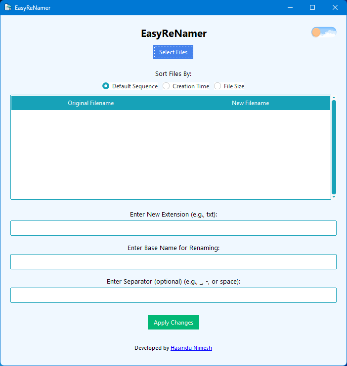
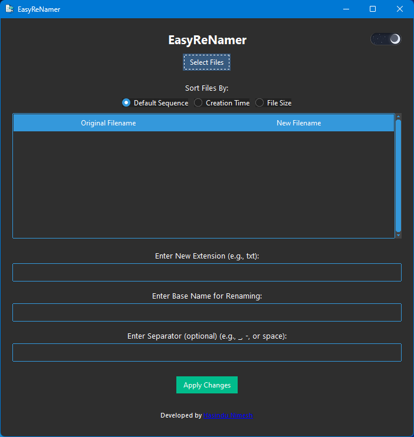
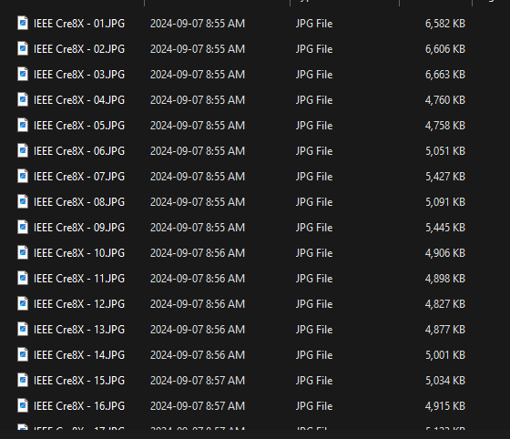

### EasyReNamer: A Smart File Renaming Tool 🖋️📂

EasyReNamer is your ultimate companion for organizing and renaming files effortlessly. Whether you're sorting photos, managing documents, or handling large batches of files, EasyReNamer saves you time and enhances productivity with its user-friendly interface and powerful features.

---

#### 🚀 **Key Features**
- **🔄 Batch File Renaming**: Rename multiple files in a single operation using custom patterns.
- **📑 File Sorting**: Sort files by creation time, size, or default sequence for better organization.
- **✏️ Custom File Extensions & Names**: Change file extensions or rename files with a consistent base name and numbering.
- **🌗 Light/Dark Mode**: Toggle between light and dark themes with a visually appealing switch.
- **👀 Real-Time Preview**: See how your files will look before applying any changes.
- **🎨 Modern UI**: Built with a sleek, responsive design powered by `ttkbootstrap`.

---

#### 🛠️ **Built With Love Using** ❤️
- **Python** 🐍: The backbone of this powerful application.
- **`ttkbootstrap`** 🎨: For a stunning and modern graphical user interface (GUI).
- **Pillow (PIL)** 🖼️: To handle and process the application’s high-quality icons and images.
- **`os` & `re`** 🗂️: For seamless file management and advanced pattern matching.
- **`tkinter`** 💻: For creating a responsive and interactive desktop application.
- **`ttkbootstrap` Constants** 📑: To give a polished, professional look to the UI.

---

#### 📥 **Installation Made Simple**
EasyReNamer is available as an **installable setup file**! Just download the setup, run it, and follow the instructions. The installer handles all the dependencies for you, making the process smooth and hassle-free. 

---

#### Home Screen

#### Light and Dark Mode

#### File Preview

---

#### 🎉 Why Choose EasyReNamer? 
- **⏳ Saves Time**: Automate repetitive renaming tasks.
- **🔧 Fully Customizable**: Adjust filenames to fit your unique organizational needs.
- **✅ Secure**: Double-check with the preview feature before applying changes.
- **💼 Professional Look**: Compact `.exe` with a polished design that integrates seamlessly into your workflow.

Get EasyReNamer now and elevate your file organization to the next level! 💡✨
